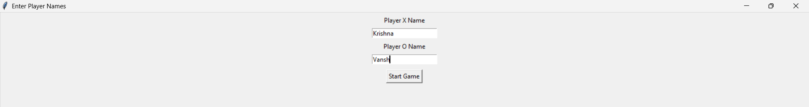
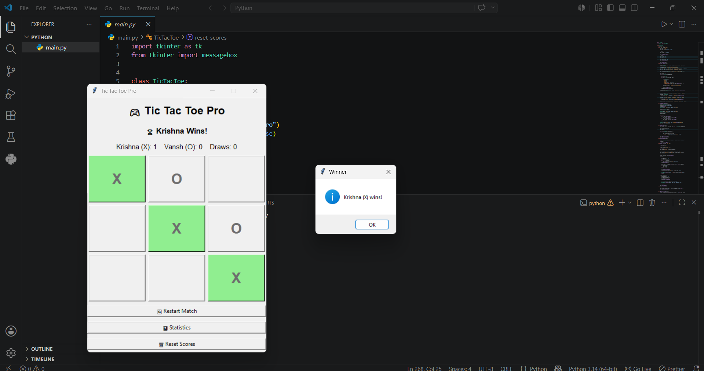

# 🎮 Tic Tac Toe Pro

A modern desktop-based Tic Tac Toe game built with **Python** and **Tkinter**.

Challenge your friends in a classic Tic Tac Toe match with score tracking, player statistics, and a clean graphical user interface.

---

## ✨ Features

### 👥 Custom Player Names

- Enter player names before starting the game
- Personalized gameplay experience

### 🎯 Turn Indicator

- Clearly shows whose turn it is
- Updates dynamically after every move

### 🏆 Winner Detection

- Automatically detects winning combinations
- Highlights the winning row, column, or diagonal

### 🤝 Draw Detection

- Detects tie games when the board is full
- Displays draw notifications

### 📊 Statistics Tracking

Track:

- Total games played
- Player X wins
- Player O wins
- Draws

### 🔄 Restart Match

- Restart the current game anytime
- Confirmation popup prevents accidental resets

### 🗑 Reset Scores

- Reset all match statistics
- Confirmation dialog included

### 🎨 Interactive GUI

- Built using Python Tkinter
- Responsive button interactions
- Colored X and O markers
- Visual winner highlighting

---

## 📸 Screenshots

### Game Window



### Winner Highlight



---

## 🛠️ Technologies Used

- Python 3
- Tkinter (GUI Framework)

---

## 📂 Project Structure

```text
TicTacToe-Pro/
│
├── main.py
├── README.md
│
└── screenshots/
    ├── game-window.png
    ├── winner-highlight.png

```

---

## 🚀 Getting Started

### Prerequisites

Make sure Python is installed:

```bash
python --version
```

Python 3.8 or later is recommended.

---

### Clone the Repository

```bash
git clone https://github.com/your-username/tic-tac-toe-pro.git
```

### Navigate to Project Directory

```bash
cd tic-tac-toe-pro
```

### Run the Application

```bash
python main.py
```

---

## 🎮 How to Play

1. Launch the application.
2. Enter names for Player X and Player O.
3. Click **Start Game**.
4. Players take turns placing X and O.
5. First player to align three symbols wins.
6. If all cells are filled without a winner, the game ends in a draw.

---

## 📊 Statistics

The Statistics window displays:

- Total Games Played
- Player X Wins
- Player O Wins
- Draw Matches

Scores remain available until manually reset.

---

## 🔮 Future Improvements

Potential enhancements:

- Single-player mode against AI
- Difficulty levels (Easy, Medium, Hard)
- Sound effects
- Dark mode
- Match history
- Save statistics to file/database
- Online multiplayer support

---

## 🤝 Contributing

Contributions are welcome.

1. Fork the repository

2. Create a feature branch

```bash
git checkout -b feature-name
```

3. Commit changes

```bash
git commit -m "Add new feature"
```

4. Push branch

```bash
git push origin feature-name
```

5. Open a Pull Request

---

## 📜 License

This project is licensed under the MIT License.

---

## 👨‍💻 Author

**Krishna**

Built with ❤️ using Python and Tkinter.
